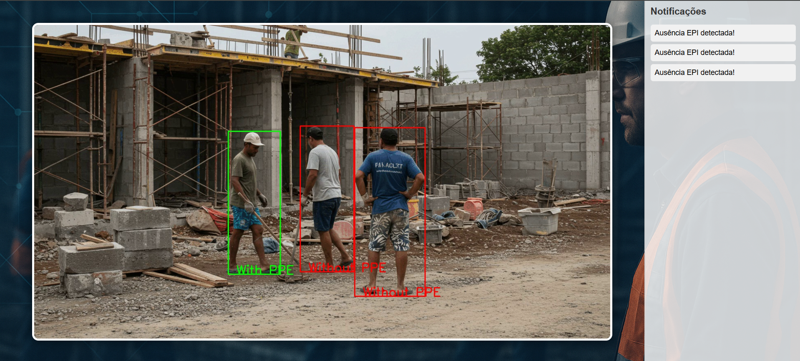

# Safe Vision

This project is a real-time monitoring web application designed to detect whether workers on a construction site are wearing the required Personal Protective Equipment (PPE). The system uses a simulated video stream and processes each frame in real time using a YOLO-based object detection model. Notifications are sent to the web interface using a websocket when 5 consecutive frames are detected with the absence of a PPE.

The interface displays the video feed and highlights detected individuals with bounding boxes. Workers who are properly wearing safety gear such as helmets, vests, and gloves are marked with green bounding boxes. Those who are missing any required equipment are marked with red bounding boxes. 

The goal of this project is to enhance workplace safety by providing an automated, vision-based surveillance tool that helps ensure compliance with safety protocols.



# About model
O modelo utilizado nesse projeto foi uma YOLOv8, tendo como base de treinamento o conjunto [PPE detection
](https://www.kaggle.com/datasets/mustafatayyipbayram/ppe-detection).


# Get Started 🚀
* This project is dockerized, so make sure you have Docker installed on your computer.

* ▶️ Start the application:
```
docker-compose up --build
```

* 🔄 Run in the background (detached mode):
```
docker-compose up -d
```

* 📄 View logs:
```
docker-compose logs -f
```

* ♻️ Rebuild and restart the containers:
```
docker-compose up --build --force-recreate
```
Initially, the ``.mp4`` file that is in the static folder is transmitted by a stream simulator that is exposed on the ``http://localhost:5000/home`` port. The detection results are presented in the ``http://localhost:5000/home`` route.


# Contributing

1. Fork the repository.
2. Create a branch for your changes (`git checkout -b feature/new-feature`).
3. Commit your changes (`git commit -am 'Add new feature'`).
4. Push to the branch (`git push origin feature/new-feature`).
5. Open a pull request.

# Contact

- **LinkedIn**: [engmarcelocolares](https://www.linkedin.com/in/engmarcelocolares/)
